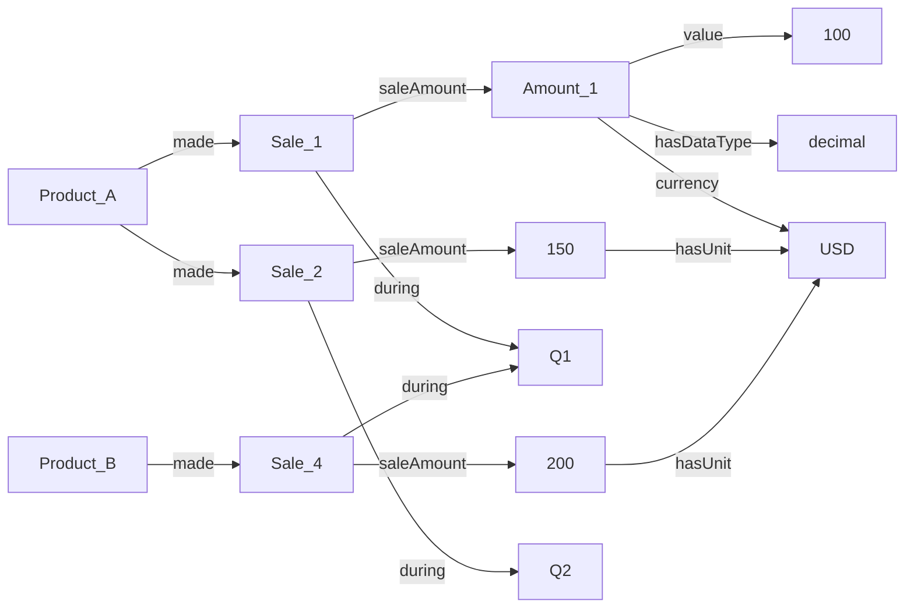

# tabular versus graphical data

### what is tabular data?
- what does the phrase 'tabular data' mean to you?

Tabular data organizes information into rows and columns, where each row is typically a record and each column an attribute. Relationships between records are implicit — you infer connections by matching values across columns.

touch on the notion of tuples?


### what is 'long' tabular data?
- In long format, measurements are stacked into rows with an extra column to identify what each value represents. The table grows *longer* as you add observations, but stays the same width.

| Product | Quarter | Sales |
|---------|---------|-------|
| A       | Q1      | 100   |
| A       | Q2      | 150   |
| A       | Q3      | 120   |
| B       | Q1      | 200   |
| B       | Q2      | 180   |
| B       | Q3      | 210   |


### what is 'wide' tabular data?
- In wide format, each subject's repeated measurements are stored in separate columns. The table grows *wider* as you add more measurement periods.

| Product | Q1  | Q2  | Q3  |
|---------|-----|-----|-----|
| A       | 100 | 150 | 120 |
| B       | 200 | 180 | 210 |

Wide format is often more human-readable and works well for summary tables or spreadsheets where you want to compare values side by side.


### what is graphical data?
- what does the term/phrase 'graphical data' mean to you?


### what is graph data?
- Graph data makes relationships explicit. It consists of **nodes** (entities) and **edges** (connections between them). The structure itself *is* the data.


##### Triple-Based Representation

Typically, each edge expresses exactly one relationship, keeping everything as explicit triples (subject → predicate → object). 
This aligns with how knowledge graphs and RDF/OWL work:

```
Product_A --made--> Sale_1
Sale_1 --during--> Q1
Sale_1 --saleAmount--> ^100 USD

Product_A --made--> Sale_2
Sale_2 --during--> Q2
Sale_2 --saleAmount--> ^150 USD

Product_B --made--> Sale_4
Sale_4 --during--> Q1
Sale_4 --saleAmount--> ^200 USD
```

Can also visualize as a graph:

